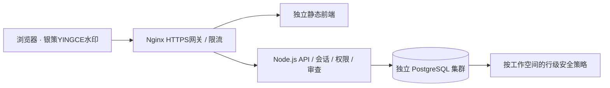

# 银策编译器 · 展业版 | 银策 YINGCE

**面向小微客户经理的可解释展业作战台。** 将制度规则、客户机会、访前准备、沟通记录与访后跟进连接起来，让每一次联系都有依据、每一步推进可以回溯。

[在线体验](https://yince.xcoria.cn/) · [部署与隔离](deploy/README.md) · [接口预留](docs/INTEGRATIONS.md) · [验收记录](deploy/VERIFICATION-20260916.md)

## v3.0：从单机演示到多用户工作空间

| 能力 | 当前实现 |
| --- | --- |
| 身份与权限 | 密码登录、服务端会话；管理员、团队主管、客户经理、审查员、只读成员；空间成员启停与权限管理 |
| 工作空间 | 每个空间独立客户、产品、规则、策略、任务、沟通记录、审查与审计；经理只操作本人负责客户 |
| PostgreSQL | 业务数据保存到后端；关系表管理身份，按空间的 JSONB 表保存业务记录；事务与行级安全策略 |
| 规则编译 | 文本提取候选规则、冲突对比、独立人工审查、历史版本与原文追溯 |
| 可解释机会 | 展示命中规则编号、版本、触发条件、实际字段与加分；优先级红／橙／绿区分 |
| 访前作战单 | 放大到期天数与日期、场景标签、已知条件与未知信息、问题与材料、确认后保存不可覆盖的准备快照 |
| 沟通渠道 | 保存经授权的电话／微信；设备拨号、手动复制微信信息；渠道、结果、原始沟通记录关联准备快照 |
| 访后闭环 | 从原始记录提取纪要草稿，人工修改确认后更新客户信息、建立任务；材料全部补齐可显式确认 |
| 审查与提醒 | 规则／纪要／客户转派申请；禁止提交人自审；转派同步未完成任务；站内待办与审查通知 |
| 团队进度 | 六阶段展业转化漏斗、负责人工作量、逾期待办和闭环进度；均由实际保存的业务记录计算 |
| 网关与水印 | Nginx 按 IP 限流、API 按用户／空间限流；429 与 Retry-After；全页面“银策YINGCE”水印 |

## 管理员入口

网站仅提供管理员登录及首次初始化，公开演示账号与演示身份切换已移除。旧演示账号、成员资格与会话均已停用，后端也拒绝遗留的演示令牌。

首次使用时，管理员凭私下提供的一次性设置码创建自己的账号与密码。管理员仍可管理正式工作空间与成员；客户、规则及任务保存在 PostgreSQL，初始 mock 数据保留用于功能验证。

五分钟流程：管理员登录 → 查看规则和客户机会 → 保存访前准备 → 登记沟通 → 确认访后纪要及任务 → 在团队权限范围内完成独立审查与跟进。

## 权限矩阵

| 操作 | 管理员 | 主管 | 客户经理 | 审查员 | 只读成员 |
| --- | --- | --- | --- | --- | --- |
| 查看客户和业务 | 全空间 | 全空间 | 本人负责 | 全空间，隐藏联系方式 | 全空间，隐藏联系方式 |
| 准备／沟通／纪要／任务 | ✓ | ✓ | 本人负责 | — | — |
| 编译／提交规则 | ✓ | ✓ | ✓ | — | — |
| 审查规则和纪要 | 独立审查 | 独立审查 | — | 独立审查 | — |
| 审查客户转派 | 独立审查 | 独立审查 | — | — | — |
| 管理成员、角色 | ✓ | — | — | — | — |

审查人不能审核自己提交的申请；最后一位有效管理员不能被停用或降级；转出业务角色前必须先移交其客户。权限在服务端逐次核验，隐藏按钮不是权限边界。

## 架构



前端使用 Next.js / React / TypeScript 静态导出；API 使用 Node.js、Zod、node-postgres。密码使用加盐 scrypt，随机会话令牌在数据库中只存摘要，HTTPS Cookie 使用 HttpOnly / Secure / SameSite=Strict。所有写操作校验 Origin 与 CSRF；操作与审计同一事务提交。浏览器 localStorage 只记住所选空间编号，不保存业务记录。

### 源码导航

- `app/`、`components/`：页面、作战单、协作与管理界面。
- `hooks/use-platform.ts`：会话、空间切换、串行写入、后台刷新。
- `server/app.ts`：认证、API 路由、限流、管理员登录入口。
- `server/platform.ts`：权限、事务命令、业务流程和模拟数据初始化。
- `server/migrations/001_platform.sql`：数据库结构、角色授权与 RLS。
- `lib/platform.ts`：命中策略、分层、场景标签与类型。
- `lib/workbench.ts`：制度提取、条件核查、访后原文提取。
- `data/`：经整理的历史公开产品摘要和模拟样例。
- `deploy/`：独立服务、网关、数据库配置与部署说明。

## 本地运行

需要 Node.js 24+、npm、PostgreSQL 14+。先按部署文档创建 `yince` 数据库和非超级用户 `yince_app`，由数据库管理员执行迁移。

```sh
npm ci
cp .env.example .env.local
# 在 .env.local 填入自己的数据库连接和随机初始化码
npm run dev:api
# 另开终端
npm run dev:vps
```

访问 `http://127.0.0.1:5173`。开发前端将 `/api/` 代理到 `127.0.0.1:59604`；生产 API 只使用 Unix socket。不要把正式密钥放入 NEXT_PUBLIC 变量或 Git。

```sh
npm test
npm run typecheck
npm run build:vps
# 集成测试必须连接全新的独立 yince_test 数据库，并运行对应测试 API
node --env-file=work/test-api.env --test tests/api.integration.test.ts
```

集成测试拒绝连接非 `yince_test` 数据库。测试账号与初始化码均为测试专用，不能用于正式站点。`out/` 是静态发布产物；独立 API 使用 `server/package-lock.json` 安装自己的精简运行依赖。

## 当前边界

- 当前是可运行的业务原型。规则提取和访后归纳采用确定性文本提取，**尚未调用大模型**，不将模板处理描述成模型推理。
- 优先级是可解释的演示策略加分，**不是授信评分、获批概率或风险评级**。展业审查通过不代表贷款审批通过。
- 产品资料包含历史公开材料；“一年改为两年”是明确标注的模拟通知，不能当作银行现行制度。正式上线前需业务人员核实有效性。
- 微信、电话、CRM 目前为经授权的联系方式、人工沟通、记录与导出；未连接企业微信、呼叫中心或银行生产系统。通知为站内通知，页面可见时每 30 秒同步。
- 数据库业务记录使用 JSONB，适合现阶段快速迭代；复杂报表、字段级数据库约束、分布式限流、SSO/MFA、企业微信回调等是后续接入项。
- API 的审计权限只允许新增和读取，但主机／数据库管理员仍可管理数据；水印也不能替代访问权限与审计。

功能验证仅使用模拟或已脱敏数据，不上传客户身份证号、完整交易明细、银行内部密钥或未获授权的联系方式。
