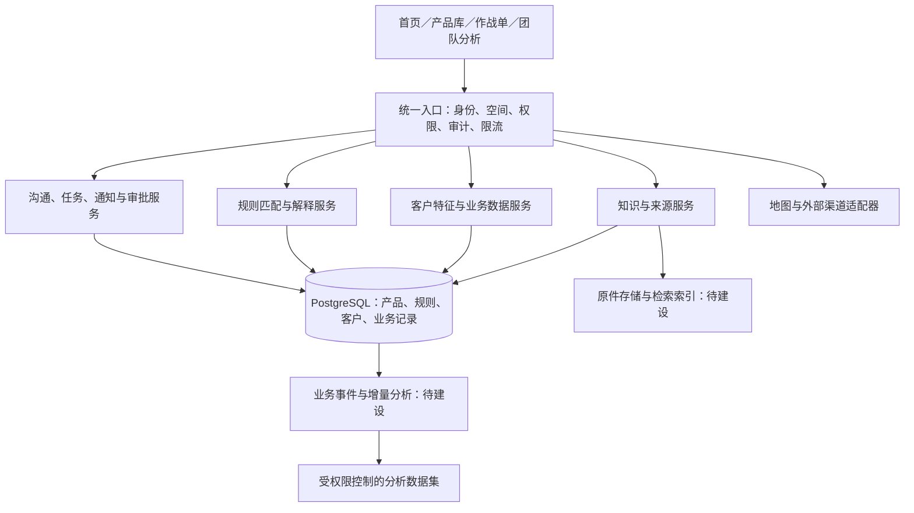

# 银策编译器·展业版：系统整体优化方案

版本：V3.1 方案稿｜日期：2026-09-29｜对象：产品、业务、技术及网点管理人员

> 项目内尚无指定申报模板，本稿采用「现状问题—优化目标—业务流程—技术实现—权限边界—实施计划—验收标准」结构。文中“已实现”以本仓库代码为准；“建议建设”不表示已接入银行生产系统。

## 一、项目概述与优化目标

系统服务小微客户经理，把产品资料、政策条件、脱敏客户特征、访前准备和访后跟进连成一条可追溯流程。

**主流程：选产品 → 匹配可见客户 → 查看每条条件及依据 → 准备沟通 → 拜访／电话／微信 → 归纳并确认 → 任务与独立审查 → 更新业务数据、重新匹配。**

本轮目标有五项：讲清规则执行机制；首页聚焦行动；收紧产品规则权限；提供位置筛选与导航；形成可复用的公共能力层。

### 现状与改进

| 现状问题 | 本轮处理 | 后续建设 |
| --- | --- | --- |
| 首页混合统计、漏斗、客户表与提醒，行动入口分散 | 首页保留大数字待办与三类准备内容，地图移入客户详情；团队漏斗留在团队进度 | 按预约时间编排当日拜访计划 |
| 容易把“模型理解政策”误认为已经落地 | 明确当前是人工整理＋确定性规则引擎；模板只能提取简单年限 | 接入受控模型提出候选，仍需人工发布 |
| 客户经理、主管原可提交规则，主管可审核 | 产品规则候选仅管理员维护；管理员／规则审查员独立审核 | 独立的总行产品管理员、制度审核员、发布员角色 |
| 没有位置字段，无法筛选附近客户 | 后端登记经营位置、区域及直线距离筛选、一键高德导航 | 地址解析、地图框选、路径排序、分支机构辖区 |
| 知识、业务数据和分析之间缺少统一设计说明 | 定义产品、证据、客户特征、匹配和业务事件之间的联系 | 知识索引、增量特征、分析数据集和统一服务目录 |

## 二、首页改版与业务交互

根据最新反馈，首页顶部保留**大数字待办概览**（待办任务、逾期待办、待审查事项），点击后进入对应工作页；下方聚焦沟通重点、问询提示和拜访前资料准备。访后跟进页的未完成、逾期、草稿与待审纪要数字也放大显示。

客户及产品选择仍在首页，选择后同步更新沟通依据与问询清单。团队漏斗留在团队进度，不堆放到首页。

| 工作区 | 内容来源 | 展示与动作 |
| --- | --- | --- |
| 待办概览 | 当前空间可见任务、审查记录 | 未完成数量、逾期数量、待审数量；大数字与直接跳转 |
| 沟通重点 | 到期日期、需求记录、联系策略、产品匹配 | 联系原因、到期时间、需求、待核实概况；打开客户详情 |
| 问询提示 | 所选产品未通过／未知／人工核实的规则 | 问题、客户事实、规则版本、原文入口 |
| 拜访前资料准备 | 缺失材料与基础准备清单 | 勾选已准备资料／索取清单，确认后保存产品与规则快照 |
| 企业信息与位置（客户详情内） | 当前客户行业、经营年限、负责人、授权位置 | 展开后维护位置、筛选附近客户、查看可配置高德底图及一键导航 |

地图不再占用首页独立区域，入口位于对应客户的作战单顶部“企业信息与位置”，保持客户上下文。附近客户仍只使用当前成员可见范围，选择后切换到对应客户详情。

准备清单勾选只表示“已准备沟通资料或索取清单”，不会把客户材料状态自动改成齐全。未知地点不自动生成，也不当作距离为零。

## 三、规则匹配如何落地（核心）

### 3.1 分清三类规则

1. **产品条件规则**：检查某客户是否满足某产品的已知基础条件，如经营年限、纳税等级、采购线索；返回符合、不符或待核实。
2. **展业联系策略**：决定先联系谁，如 45 天内到期、已有资金需求、材料待补。联系优先级不是授信概率，也不替代产品条件。
3. **流程与权限规则**：决定谁能查看、修改、确认、审查；由 API 强制执行，不能依靠前端隐藏按钮。

### 3.2 制度到可执行规则的链路


**当前实际能力：**5 款附件产品由人工核对资料后整理为可执行条件，保存在 PostgreSQL；文本编译器仅提取明确、简单的经营年限表达，不调用大模型，不自动理解复杂制度。税易贷、政采贷等条件各自关联产品；原始截图未提供产品名称的经营流水类规则单独归属待核实产品。

**建议建设：**文件解析器保留原件哈希、页码／单元格、条款编号与文件版本；大模型仅生成符合 JSON Schema 的候选，不产生可直接执行的任意代码。枚举不明、括号例外、分支条件未覆盖时，返回人工核实项，不能静默丢弃。

### 3.3 数据模型与执行契约

当前业务表采用 `(workspace_id, id, payload JSONB)` 存储并启用行级安全。下一阶段建议把经常筛选与约束的字段显式列化，不必先拆微服务。

| 对象 | 必须保存的信息 | 当前／建议 |
| --- | --- | --- |
| 产品 | productId、名称、适用对象、产品资料来源 | 已实现 |
| 规则 | productId、ruleId、字段、运算符、阈值、原文、来源位置、版本、状态、生效日 | 已实现；生效日可能待核实 |
| 客户特征 | customerId、字段值；未知值为 null | 已实现；逐字段采集时间、有效期、可信来源待补 |
| 匹配结果 | customerId、productId、每条条件结果、实际值、规则版本、汇总状态 | 后端即时计算并返回；尚未建立独立历史匹配表 |
| 访前快照 | 产品名称、客户快照、产品规则快照、联系策略命中、确认人与时间 | 已实现，不覆盖历史快照 |
| 规则修订记录 | 提交人、独立审核人、处理意见、版本及审计 | 已实现审查；文件哈希、影响报告、失效日／定时发布待补 |

示例（税易贷，历史附件 Sheet1!H3，不表示现行制度）：

```json
{
  "productId": "PRODUCT-3",
  "id": "PRODUCT-3-GRADE",
  "field": "taxGrade",
  "operator": "in",
  "value": ["A", "B", "C"],
  "source": "P020250723600413272167.et",
  "location": "Sheet1!H3",
  "version": "product-v1.0",
  "status": "active",
  "effective": null
}
```

将示例客户 `taxGrade = "M"` 与此条件比较，得到“不符”；缺少该字段得到“待核实”；A/B/C 得到“该条件符合”。这一步是可复算的程序判断，不依靠模型给出主观分数。

### 3.4 执行次序

1. 校验会话和工作空间成员资格，客户经理只保留本人负责客户。
2. 读取所选产品的启用规则，候选和归档规则不参与匹配。
3. 对每个客户逐条调用规则求值函数。目前支持 `gte`、`eq`、`in`、`review`，以及政采贷“企业经营年限或主要经营人员经验满足其一”的专用条件。
4. 用三种状态处理单条结果：`pass`、`fail`、`unknown`。缺字段、null、需人工复核均不能当作通过；数值 0、布尔 false 不是缺失值。
5. 汇总：存在已知不符 → 已知条件不符；否则有缺失或没有自动条件 → 信息待补充；否则 → 基础条件匹配。人工核实项单独计数，基础匹配仍可能有未完成的人工项。
6. 当前按“匹配状态 → 已符合数量 → 联系优先级”排序。界面展示条件标题、实际值、版本，并能打开原文来源。
7. 选择客户后，问询提示从未知、不符及人工核查项生成；产品上下文贯穿访前快照、沟通与访后记录。

九融贷存在企业、个体经营者、农户分支及例外，现阶段保留人工核查，不把其中一个分支的 2 年／700 分条件当成适用于所有人的统一判断。

### 3.5 冲突、版本与可解释性

当前同一产品、同一字段的新版本通过独立审查后，归档旧的启用版本；不能归档其他产品的同名字段。历史访前与纪要保留原快照。

生产化需补充：

- 冲突键升级为 `产品＋客户分支＋适用地区＋条件项`，避免同字段的不同分支被误替换。
- 执行时按有效起止日期和已发布状态选择规则，补足失效日、定时启用和回滚机制；**当前不是完整的时间版本引擎**。
- 新版发布前使用固定回归客户集生成影响报告：新增匹配、转为待核实、已知条件不符分别多少，抽样回看原文。
- 将一次匹配的规则集合版本、客户特征时间、输入摘要和结果摘要持久化，支持重放；不把仅有日志等同于完整可重放能力。
- 数据超过有效期，按未知处理并生成补录问题，不继续使用旧数据给出确定结果。

### 3.6 验收案例

| 输入／动作 | 预期结果 |
| --- | --- |
| 税易贷纳税等级 M | 该条件不符，不自动认定客户拒贷 |
| 纳税等级缺失 | 信息待补充；显示需核实问题 |
| 政采贷企业年限缺失，但人员经验满足 | OR 条件通过，其他条件仍分别核查 |
| 九融贷仅有复杂分支原文 | 人工核实，不生成虚假的通用准入结论 |
| 修改税易贷经营年限 | 不改变智享贷经营年限规则 |
| 新规则启用后查看旧访前快照 | 仍显示当时版本与客户信息 |
| 客户经理查询其他负责人客户 | 服务端拒绝或从列表排除 |

## 四、规则库权限与网点负责人边界

### 4.1 本轮实施的最小权限

| 操作 | 管理员（须由业务授权） | 网点负责人／主管 | 客户经理 | 规则审查员 | 只读成员 |
| --- | --- | --- | --- | --- | --- |
| 查看产品及规则来源 | 当前空间 | 当前空间 | 当前空间 | 当前空间 | 当前空间 |
| 编译并保存产品规则候选、提交规则审查 | ✓ | — | — | — | — |
| 审查产品规则 | 其他人提交 | — | — | 其他人提交 | — |
| 直接覆盖启用规则／修改历史快照 | — | — | — | — | — |
| 修改客户需求、纪要、资料状态、经营地点 | 空间内 | 空间内 | 本人负责客户 | — | — |
| 审查纪要 | 其他人提交 | 其他人提交 | — | 其他人提交 | — |
| 审查客户转派 | 其他人提交 | 其他人提交 | — | — | — |
| 更改角色／管理成员 | ✓ | — | — | — | — |

权限在每次 API 请求重新校验。禁止自己提交自己审核；界面禁用不能代替接口鉴权。这符合默认拒绝、最小权限及逐请求验证的工程原则。[OWASP 授权检查指南](https://cheatsheetseries.owasp.org/cheatsheets/Authorization_Cheat_Sheet.html)

### 4.2 网点负责人到底能改什么

**本轮可执行的操作：**本工作空间客户需求、经营信息和位置维护，访后纪要与跟进安排，客户转派申请／独立审查。不能改产品准入、禁入、利率、额度、期限、担保要求或规则生效日期。

**建议新增的网点配置：**联系时段、拜访频次、提醒提前天数、辖区／网格、内部话术模板、团队任务分配。采用独立 `branch_settings`，字段白名单、取值范围和上级版本约束；如涉及排序权重，应单独授权并限制范围，不能借“网点配置”改变产品资格判断。上述配置模块尚未实现。

**不能把系统管理员自动等同于银行产品审批人。**当前 admin 只是原型中的授权维护者。银行落地需将“组织角色”和“具体权限”分离，增加产品维护、合规复核、发布授权，网点负责人只能作用于明确 branch_id 范围。当前只有工作空间和客户负责人隔离，没有正式组织树／网点层级，不能宣称已完成总分支行三级权限。

## 五、高德地图功能评估与实现

### 5.1 本轮交付与边界

- 位置记录保存到现有客户 JSONB，由 API 校验范围、坐标系、权限及授权；不会自动给真实或模拟客户编造地址。
- 只使用 **GCJ-02**。GPS WGS84／百度 BD09 需通过合适的坐标转换服务核实后再录入；本轮未接转换或地址解析。
- 区域文本筛选；以当前选中客户位置为中心的直线距离筛选；未登记地点不参与距离计算。**这不是“距手机当前位置”的定位功能，也不是驾车里程。**
- 一键导航先在后端检查权限和地图授权、记录审计，再打开高德 URI。外发参数仅目的地坐标及通用标签，不传客户编号、姓名、电话或融资资料。
- 支持驾车、步行、公交。移动端尝试调起 App；未装 App、微信等容器可能只打开网页或需要浏览器处理。未传起点时，高德自动使用当前位置仅适用于移动端；PC 需补选起点。[高德 URI 路径规划](https://lbs.amap.com/api/uri-api/guide/travel/route)

### 5.2 嵌入式地图方案

采用高德 JS API 2.0，按需加载，地图容器显示授权地点的标记；点击标记切换当前客户。未配置 Key／安全代理时显示“待配置”，区域筛选、位置录入和 URI 导航仍可使用。

配置 Web 端 JS Key 与安全代理 `serviceHost`，安全密钥在代理侧保管；不能提交仓库或写入 `NEXT_PUBLIC_*`。高德文档提供安全代理方式。[高德 JS API 安全密钥](https://lbs.amap.com/api/javascript-api-v2/guide/abc/jscode)

本轮已写好可配置的底图组件，**尚未获得真实 Key，未完成带 Key 的底图／标记联调**。启用时还需配置域名白名单、授权用途及服务额度，并验证超时、代理错误、浏览器兼容性。正式银行环境应评估将第三方地图 SDK 放到独立受限页面／域名，仅传地图所需数据。

### 5.3 部署与规模

保持银策 API 的 Unix socket 出站隔离。地图 URI 由用户浏览器打开；未来服务端地址解析／安全代理使用独立地图适配器或受控代理，配置固定上游、限流和审计，不直接放开业务 API 全网访问。

当前每空间最多 500 位客户，先在已鉴权返回的客户范围内做区域与直线距离筛选；不能把全行客户坐标下载到浏览器再筛权限。大规模时采用数据库空间索引、区域／经纬度边界框查询和分页。PostGIS `ST_DWithin` 可用于有相容空间参考的距离查询并利用索引；GCJ-02 显示坐标不能直接冒充 WGS84 的 EPSG:4326。[PostGIS ST_DWithin](https://postgis.net/docs/ST_DWithin.html)

数据量升级时保留明确坐标系及原始／转换后字段，先校验机构和负责人权限，再查询空间范围。位置命中只辅助安排路线，不改变产品准入规则。

## 六、公共能力平台：怎么融合，怎么复用

### 6.1 采用模块化单体起步

在现有 API、PostgreSQL 和独立静态站上划分清晰模块，先用模块接口复用；已有小规格 VPS 不适合为了概念完整堆叠多个服务。达到吞吐量、团队边界或安全要求后再拆分。



### 6.2 各能力的职责与共享契约

| 公共能力 | 负责什么 | 复用方式／不应混淆的边界 |
| --- | --- | --- |
| 知识与证据 | 保存原件、条款、适用范围、版本、来源位置；提供检索 | 统一 EvidenceRef；检索到某段文字不代表该规则已审核启用 |
| 业务数据库 | 客户、产品、归属、任务、纪要、审查事实 | 统一 workspaceId、productId、customerId，业务 API 控制写入 |
| 特征服务 | 将业务字段标准化并带来源、更新时间、有效期 | 同一经营年限可被多产品引用；不能把未知补成 0 |
| 规则引擎 | 按选定版本求值，输出事实与解释 | 首页问询、产品匹配、批量重算共用同一求值函数 |
| 模型服务 | 条款候选提取、问询润色、纪要草稿 | 只生成待确认结果；不能更改正式规则、直接批贷或直接执行 SQL |
| 分析能力 | 任务时效、材料补齐率、匹配覆盖、拜访转化 | 读取受权限控制的视图／数据集，指标定义统一；分析侧不能直接写规则 |
| 流程与渠道 | 准备快照、沟通、任务、通知、CRM 待写入与回执 | 使用业务事件和幂等编号；渠道发送成功不等于客户已成交 |
| 地图 | 位置、区域、范围筛选、导航适配 | 只接收必要坐标，沿用同一客户权限；不接触贷款决策 |

建议接口（**设计稿，不代表已部署路由**）：

```text
knowledge.search(workspaceId, productId, query) -> evidenceRefs[]
features.read(workspaceId, customerId, asOf) -> values + provenance
rules.evaluate(workspaceId, productId, customerId, ruleSetVersion) -> checks + unknowns
workflow.confirmBrief(customerId, productId, matchRunId, checklist) -> briefId
analytics.query(datasetId, filters, scope) -> aggregatedMetrics
maps.search(scope, region, center, radius) -> permittedLocations
```

### 6.3 知识库、数据库、分析如何协同

以“客户经营年限由未知补齐”为例：

1. 纪要草稿指出需补年限，客户经理核实后通过业务接口确认，写入客户事实及来源。
2. 同一事务写业务事件（未来 outbox），消费者按 eventId 去重，找出引用 operatingYears 的产品规则重新匹配。
3. 匹配变化更新待核实清单；不改写先前访前快照，不自动发送营销消息。
4. 分析侧记录“字段补齐耗时”“匹配从未知转为可判断”等指标，供团队看板使用。
5. 知识库仍保留规则的制度出处；客户事实变更不改变制度原文。全文／向量检索用于查资料，结构化规则用于可复算判断。

按 workspace/branch/user 权限贯穿所有数据集、检索索引与缓存键，向量检索也必须先限定可见文档范围，不能先跨空间召回后把敏感摘要交给模型。初期可用 PostgreSQL 全文检索；确有语义检索需求再评估 pgvector，不需要复制一套独立客户主库。

## 七、实施计划与验收

下列周期是供排期的估算，需结合银行资料、接口和审核人员到位情况调整。

| 阶段 | 工作与交付 | 验收门槛 |
| --- | --- | --- |
| 本轮 | 待办与准备首页、产品规则权限收紧、位置登记／筛选／URI 导航、方案文档 | 类型检查、构建、规则与权限测试；无 Key 状态可用，未知位置明确显示 |
| 1：业务校准（约 1–2 周） | 确认 1 款产品完整制度、字段字典、组织角色和回归客户集 | 业务人员逐条签认来源、例外与期限；确定性条件用例全部通过 |
| 2：地图与分支范围（约 1–2 周） | Key／授权配置、代理、地图标记联调、branch_id 与网点配置白名单 | 不越权看位置、不外发身份信息；手机和 PC 各完成一次导航；限流可验证 |
| 3：规则生产化（约 2–3 周） | 分支规则、有效期、影响报告、发布／回滚、输入与输出重放 | 指定版本可复算；权限绕过测试失败；回滚不会改写历史 |
| 4：公共能力复用（按接口到位推进） | 文档索引、字段来源、业务事件、分析数据集与一个外部适配器 | 同一能力被至少两个业务入口复用；事件幂等；指标定义一致 |

### 建议观测指标

- 规则来源覆盖率、业务审核覆盖率、人工项比例、匹配未知率。
- 每次访前准备耗时、材料补齐时长、跟进逾期率、从准备到完成沟通的转化。
- 权限拒绝、审查退回、规则变更影响范围、地图加载／导航发起成功率。
- 在固定匿名回归集上测匹配正确性；不能用联系率或贷款通过率反向证明规则判断正确。

不预先承诺效率提升百分比。先记录基线，试点后比较同类客户、同一统计口径的数据。

## 八、当前限制与待补输入

1. 无指定外部模板：本稿可直接评审，之后按模板迁移章节。
2. 无高德 Key／安全代理配置：外部导航可用，嵌入式底图待联调。
3. 原始资料属于历史附件，现行产品名称、有效期、完整准入及例外需业务确认。
4. 当前没有正式总分支行组织树、专职发布角色、自动文档解析、向量库或模型调用；这些已明确列入建设项。
5. 电话／微信仍为人工沟通与记录，不会自动拨打、发消息或写入银行生产 CRM。

## 九、实现位置与追溯

- `components/fieldwork-home.tsx`：待办与准备首页，客户／产品联动、访前确认。
- `components/customer-map.tsx`：经营位置表单、区域／距离筛选、高德底图预留及导航。
- `lib/fieldwork.ts`：位置校验、距离计算、导航 URL、问询提取和规则权限策略。
- `lib/product-matching.ts`、`lib/workbench.ts`：产品匹配、三态求值和规则来源。
- `server/platform.ts`：逐请求权限校验、位置持久化、导航审计、规则审查。
- `docs/地图接入配置.md`：配置说明、未接入能力和投产检查。
